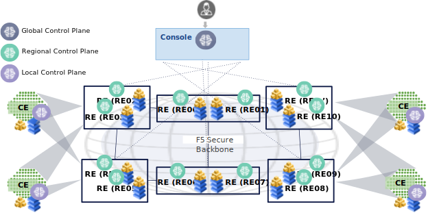
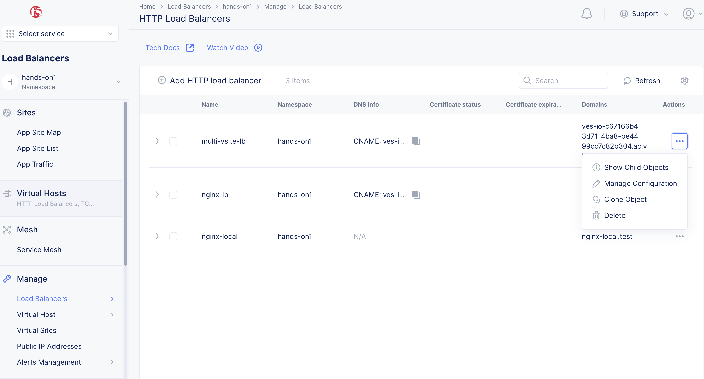
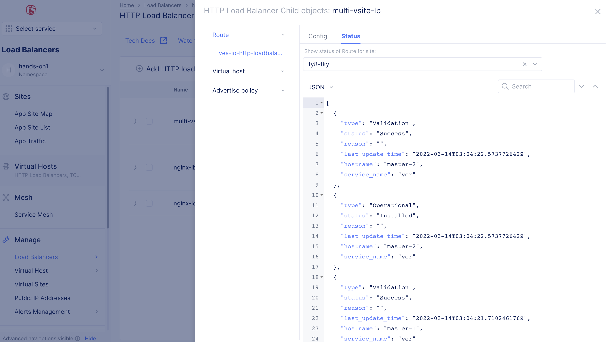

# DCSのコントロールプレーン

DCSのコントロールプレーンは下図のように階層構造になっています。



ユーザーはConsoleのGlobal Control planeからコンフィグや設定情報を取得します。Global Control planeで設定されたコンフィグは、該当のRegional Control planeに転送され、RE上のデータベースに情報が保存されます。
そのコンフィグがRegional Edge(RE)に設定する情報であれば、RE上にコンフィグを展開します。
そのコンフィグがCustomer Edge(CE)に設定する情報であれば、該当のCEにコンフィグを展開します。

Global Control planeはユーザーのコンフィグ情報をすべて保存します。REのデータが消去された場合でもGlobal Control planeから最新データを取得し復元することが可能です。
同様にCEもデータが消去された場合でもREから最新データを取得し復元することが可能です。（ただし、Managed K8sの場合、ローカルAPIでコンフィグされたデータは復元不可）

WebUIから、これらのコンフィグが正常にコントロールプレーンに伝達されたかを確認することが可能です。

例えばロードバランサーのコンフィグがREに伝搬されたかを確認するには `Load Balancers` -> `Manage` -> `Load Balancers` -> `Show Child Objects` でステータスを表示します。

Statusタブを開くとどのサイトのリストが表示されます。確認したいサイトを選択すると情報が表示されます。




Load balancerには複数のObjectが内部的に存在しますが、それぞれのObjectが各ノードに正常に伝搬されているかをこの画面で確認できます。
各ホストの "status"が "Success"になっていれば正常です。

```JSON
  {
    "type": "Validation",
    "status": "Success",
    "reason": "",
    "last_update_time": "2022-03-14T03:04:22.573772642Z",
    "hostname": "master-2",
    "service_name": "ver"
  },
  ```

コンフィグが存在しないサイトを指定すると `No status objects found.` と表示されます。

Control planeに異常がある場合、コンフィグを該当サイトに設定しているにも関わらず、`No status objects found.`と表示されます。この場合、サポートに問い合わせてください。
