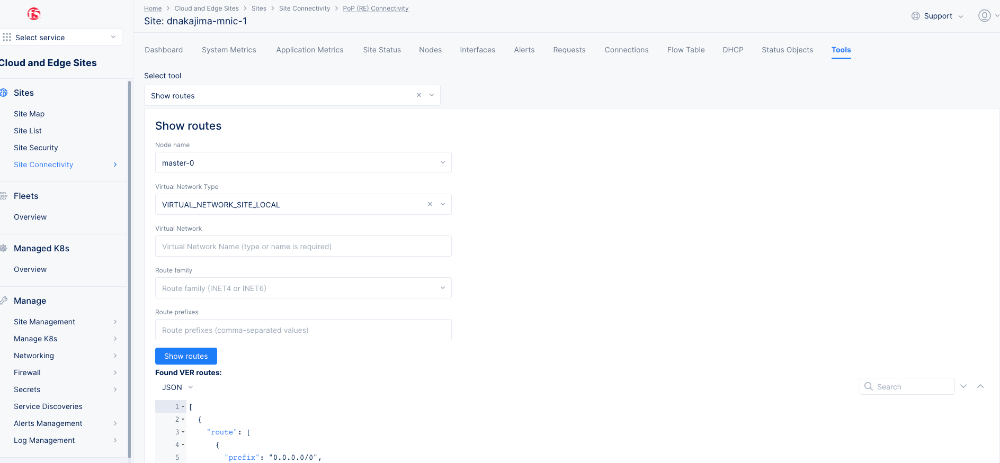

# DCS Siteのデータプレーン

DCS Site (CE)のデータプレーンはOutsideとInsideに分かれています。Outside (はREとトンネルをはり、通常インターネットなどの外部ネットワーク接続のインターフェイスとなります。Insideはオプションです。
この2つのネットワークはそれぞれルーティングテーブルが別れています(VRF)。


出典:F5.com

## ルーティングテーブルの確認

ルーティングテーブルはConsoleから確認できます。 `Cloud and Edge Sites` -> `Site list` -> `サイト名` -> `Tools` -> `Show routes`



この画面から表示したいSiteのノードを選択し、VIRTUAL_NETWORK_SITE_LOCAL(Outside)もしくはVIRTUAL_NETWORK_SITE_LOCAL_INSIDE(Inside)を選択し、Show Routesをクリックするとルーティングテーブルが表示されます。

Podの通信がうまくできない。などのトラブルの場合はルーティングテーブルを確認します。

ここでデフォルトルートやスタティックルートが表示されていることを確認し、かつ`"nh_info"`が`Arp for x.x.x.x, Resolved true`とARP解決されていることも確認します。
ここでARPが解決されていない場合、L2ネットワークの問題の可能性があります。

このルーティングテーブルはデバッグ用のため、CNIで使っている内部情報を含むため、`nh`や`label`などは無視してください。
また、内部通信でつかっている`169.x.x.x`もPodなどのトラフィックには関係ないルートのため無視してください。

```
[
  {
    "route": [
      {
        "prefix": "0.0.0.0/0",
        "nh": 34,
        "flags": "",
        "label": 0,
        "nh_info": "Arp for 192.168.201.1, Resolved true"
      },
      {
        "prefix": "169.254.0.10/32",
        "nh": 45,
        "flags": "",
        "label": 0,
        "nh_info": "Nat: Src 10.101.146.121/32 , SPorts nil, Dest 172.16.20.254, DPorts map[]"
      },
      {
        "prefix": "169.254.0.11/32",
        "nh": 44,
        "flags": "",
        "label": 0,
        "nh_info": "Nat: Src 10.101.146.121/32 , SPorts nil, Dest 172.16.14.126, DPorts map[]"
      },
      {
        "prefix": "169.254.10.1/32",
        "nh": 32,
        "flags": "",
        "label": 0,
        "nh_info": "Vrf"
      },
      {
        "prefix": "169.254.252.1/32",
        "nh": 107,
        "flags": "",
        "label": 272,
        "nh_info": "Interface vega-argo-log-0"
      },
      {
        "prefix": "169.254.253.1/32",
        "nh": 38,
        "flags": "",
        "label": 0,
        "nh_info": "Interface site-local-vn_FStack_Envoy_0"
      },
      {
        "prefix": "169.254.254.6/32",
        "nh": 114,
        "flags": "",
        "label": 0,
        "nh_info": "Interface pkt0"
      },
      {
        "prefix": "192.168.201.0/24",
        "nh": 20,
        "flags": "",
        "label": 0,
        "nh_info": "Resolve on interface eth0"
      },
      {
        "prefix": "192.168.201.1/32",
        "nh": 34,
        "flags": "",
        "label": 0,
        "nh_info": "Arp for 192.168.201.1, Resolved true"
      },
      {
        "prefix": "192.168.201.18/32",
        "nh": 24,
        "flags": "",
        "label": 0,
        "nh_info": "ECMP: Receive on interface vhost0; Interface vethpmtud0-logical; "
      },
      {
        "prefix": "192.168.201.19/32",
        "nh": 1399,
        "flags": "",
        "label": 0,
        "nh_info": "Arp for 192.168.201.19, Resolved true"
      },
      {
        "prefix": "192.168.201.20/32",
        "nh": 2379,
        "flags": "",
        "label": 0,
        "nh_info": "Arp for 192.168.201.20, Resolved true"
      },
      {
        "prefix": "192.168.201.21/32",
        "nh": 1141,
        "flags": "",
        "label": 0,
        "nh_info": "Arp for 192.168.201.21, Resolved true"
      },
      {
        "prefix": "192.168.201.22/32",
        "nh": 2496,
        "flags": "",
        "label": 0,
        "nh_info": "Arp for 192.168.201.22, Resolved true"
      },
      {
        "prefix": "192.168.201.23/32",
        "nh": 2274,
        "flags": "",
        "label": 0,
        "nh_info": "Arp for 192.168.201.23, Resolved true"
      },
      {
        "prefix": "192.168.201.30/32",
        "nh": 1282,
        "flags": "",
        "label": 0,
        "nh_info": "Arp for 192.168.201.30, Resolved true"
      },
      {
        "prefix": "192.168.201.31/32",
        "nh": 2572,
        "flags": "",
        "label": 0,
        "nh_info": "Arp for 192.168.201.31, Resolved true"
      },
      {
        "prefix": "192.168.201.33/32",
        "nh": 3002,
        "flags": "",
        "label": 0,
        "nh_info": "Arp for 192.168.201.33, Resolved true"
      },
      {
        "prefix": "192.168.201.43/32",
        "nh": 2264,
        "flags": "",
        "label": 0,
        "nh_info": "Arp for 192.168.201.43, Resolved true"
      }
    ],
    "node": "master-0"
  }
]
```

## Flow tableの確認

ルーティングテーブルが正常でも通信ができない場合はFlow tableを確認します。`Cloud and Edge Sites` -> `Site list` -> `サイト名` -> `Slow table`で該当ノードを選択するとFlowが表示されます。

DCSのデータプレーンは独自実装となっており、通信をFlowとして管理します。Flowは 5Tupleで構成され、FlowごとにActionが決定されます。ActionはFowrard、Drop、NATなどが表示され、Dropの場合は`Drop reason`にDropされた理由が表示されます。通常Flowは行きと戻りの2Flowがペアとなりテーブルが作成されます。

NATのフラグは以下となります
- S=SNAT
- D=DNAT
- Ps=SPAT
- Pd=DPAT
- L=Link Local Port

例えばPodが外部にTCPの通信を行った場合、以下のようなテーブルが作成されます。対応しているFlowは`Flow Index`と`Reverse Flow index`が対になっており確認ができます。

このFlowのPodのIPアドレスは`100.127.0.65`で宛先は`72.19.3.143`です。Protocolが`1`なのでICMPということがわかります。

PodはNATされるため、下段のFlowのActionが`Nat(SPsm)`と表示されます。このフラグから、PodのIPアドレスがNATされ、Port変換が行われていることが確認できます。

戻りのFlowは上段となり、送信元が`72.19.3.143`で送信先が`192.168.201.18`です。この送信先IPはSiteのOutsideインターフェイスのIPアドレスです。

この宛先IPアドレスとポートは対応したPodに戻す必要があるため、ActionはNAT(PsD)となっています。


以下のFlowはPodからの通信がDropされていることを示しています。

Actionが`Drop`になっており、Drop Reasonには`Forward Policy`と表示されています。この場合、ユーザー定義されたNetwork policyでトラフィックがDropしています。通信をさせたい場合はNetwork policyの見直しが必要です。


Drop reasonには様々な種類があります。ルーティングテーブルが正常でForward Policyも設定していないのに、Drop Reasonが表示されて通信ができない場合、データプレーンの異常も考えられるため、サポートに問い合わせてください。

## BGPの確認

DCSではBGPをサポートしています。BGPの設定が正しくされているかは`Cloud and Edge Sites` -> `Manage` -> `Networking` -> `BGPs`の該当BGPコンフィグのShow Global Statusで確認できます。

正常にPeerが上がっていると`up_down`のステータスが　`BGP_PEER_UP`にっています。


BGPの設定ミスなどでPeerが上がらない場合、`BGP_PEER_DOWN`と表示されます。BGPコンフィグの確認をしてください。

```
          },
          "peer_port": 179,
          "up_down": "BGP_PEER_DOWN",
          "peer_router_id": "",
          "peer_asn": 65500,
          "up_down_timestamp": null,
          "connection_flap_count": 0,
          "advertised_prefix_count": 0,
          "received_prefix_count": 0,
          "interface_name": "eth0",
          "local_address": "192.168.201.18"
        }
```

`Cloud and Edge Sites` -> `Site list` -> `サイト名` -> `Tools` -> `Show BGP peers`でも確認ができます。


BGPで受け取った経路情報は `Cloud and Edge Sites` -> `Site list` -> `サイト名` -> `Tools` -> `Show BGP routes`で確認できます。

受け取った経路情報は Toolsの`Show routes`で反映されていることを確認できます。


BGPの経路情報がルーティングテーブルに存在しない場合、NLRIなど経路情報を確認してください。
経路が正しいにも関わらずルーティングテーブルが更新されない場合、サポートに問い合わせてください。