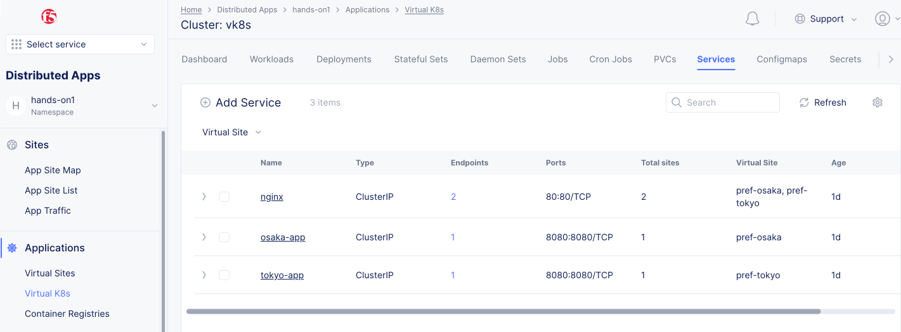
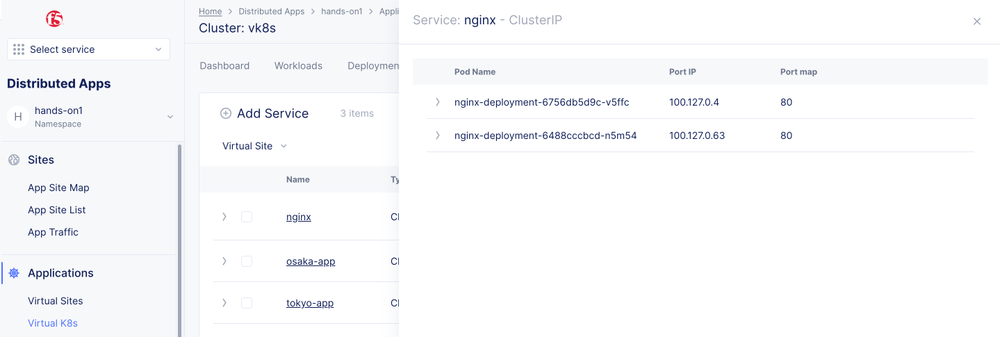
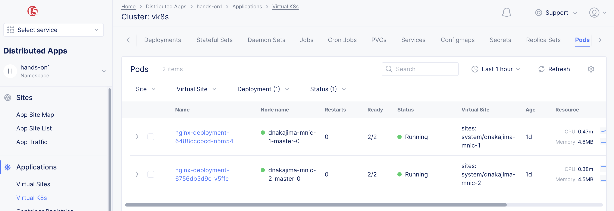
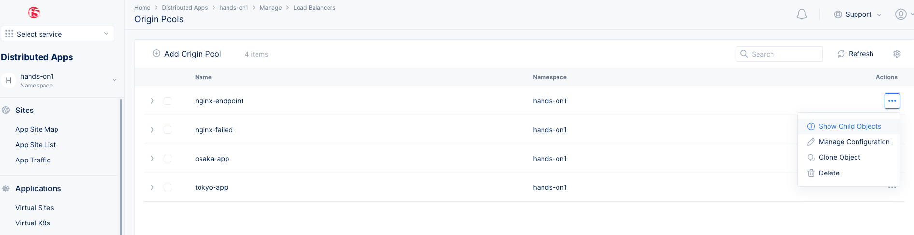
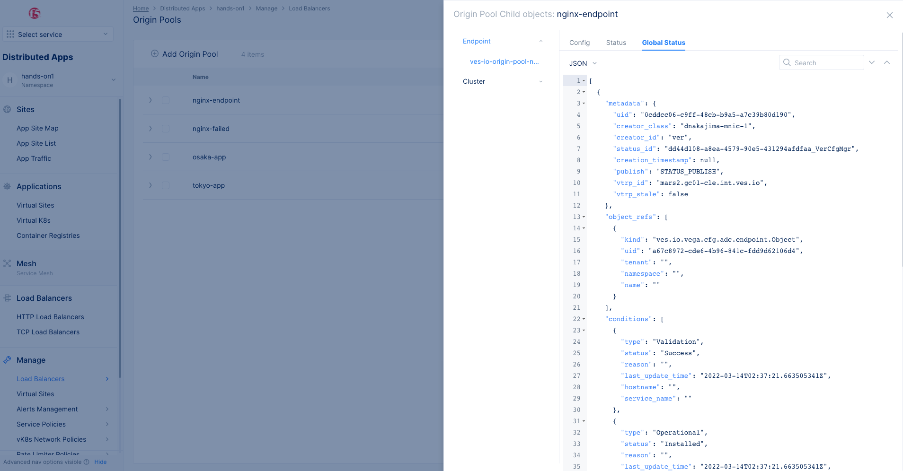

# Load balancerのデバッグ

外部からKubernetes serviceにアクセスできない場合や、K8sアプリが別SiteのKubernetes serviceや外部サービスにアクセスできないなど、Load balancerのデバッグを行うには以下のような手順での確認が有効です。

1. Endpointの正常性確認
1. Origin poolの動作と設定確認
1. Load balancerの動作と設定確認

## 1. Endpointの正常性確認

Origin poolの宛先としてはvk8s上のServiceだけでなく、インターネット上のサービスをDNSやIPアドレスで指定する、Siteのローカルネットワークに接続されている内部サービスをDNSやIPで指定するなど、様々なEndpointが登録できます。

例えば vk8s上のサービスは各ObjectのUIで確認できます。k8s ServiceのEndpointsの数字をクリックすると、K8s serivceのターゲットPodが表示されます。また、Deploymentの数字をクリックすると、Deplyomentで立ち上げられたPodが表示されます。

これらの情報がきちんと表示され、Podが正常かどうしているかの確認が必要です。





外部サービスの場合、該当のSiteやREからの到達性があるかの確認が必要です。
Siteの場合はLocal CLIやGUIでPingを打つことで到達性やDNSの解決がされるかの確認ができます。サービス側でACLなどでブロックされていないか確認してください。

内部サービスの場合、該当Siteからの到達性を確認します。ルーティングなどが適切に設定されているか確認してください。

## 2. Origin poolの動作と設定確認

トラブルで一番多いのがOrigin poolの設定ミスです。Origin poolが正常にEndpointを確認できているかは、`Load Balancers` -> `Manage` -> `Origin pool`から該当オブジェクトの `Show Child Objects`で確認ができます。

正常にEndpointが設定されていると、EndpointのGlobal StatusにEndpoint情報が表示されます。




例えばvk8sのサービスをOrigin poolに設定した場合、`"ver_status"`にKusernetes Service名やPod名が表示されます。

```
    "ver_status": [
      {
        "service_name": "nginx.hands-on1",
        "discovered_ip": {
          "ipv4": {
            "addr": "100.127.0.63"
          }
        },
        "discovered_port": 80,
        "allocated_ip": {
          "addr": "ff::24:c00:63"
        },
        "site": "dnakajima-mnic-1",
        "health_status": {},
        "discovered_info": {
          "k8s_info": {
            "in_cluster_discovery": true,
            "pod_name": [
              "nginx-deployment-6488cccbcd-n5m54"
            ],
            "labels": {
              "app": "nginx"
```

Global Statusが表示されず、`No status objects found.`となっている場合、Origin poolのEndpointの指定が間違っている場合があります。以下のような間違いが多いので、Origin poolの設定を確認してください。

- Kubernetes service名が間違っている。フォーマットは <Kubernetes service名>.<Namespace>です。
- SiteやVirtual Siteの指定が間違っている。実際にServiceが稼働しているSiteや内部ネットワークに接続しているSiteを選択してください。
- Select Network on the siteの指定が間違っている。 vk8sの場合、`vK8s Networks on Site`を指定します。
- Port番号が間違っている。

上記を確認しても問題が解消されない場合、異常が発生している可能性があるため、サポートに問い合わせてください。

## 3. Load balancerの動作と設定確認

Load balancerの設定で多いのはドメイン名とSite/Virtual siteの設定ミスです。

HTTPのホストヘッダやHTTPSのSNIに設定されたドメインとLoad balancerのドメインは一致する必要があります。
このドメイン名が異なると、適切なOrigin poolが選択できず、ブラウザにはNot foundなどが表示されます。

デフォルトではLoad balancerは `On internet`なのでDCSのRE上にLoad balancerのコンフィグが展開されます。このため、特定のSiteにLoad balancerを適用したい場合は`Show Advances Field`を有効にして適切なSite/Virtual siteを指定する必要があります。

適切なコンフィグを行っているにも関わらず、`Show Child Objects`のStatusが表示されない場合、DCS側のコントロールプレーンの異常などが考えられるため、サポートに問い合わせてください。
